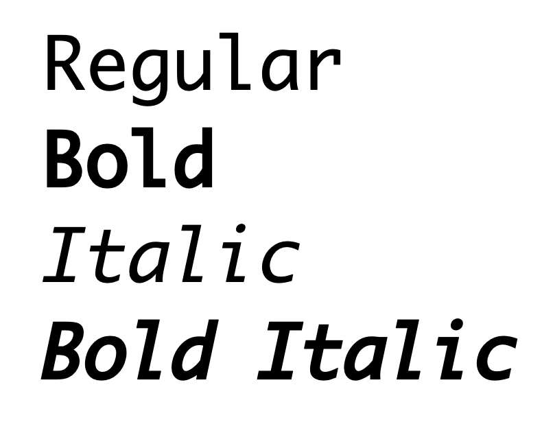
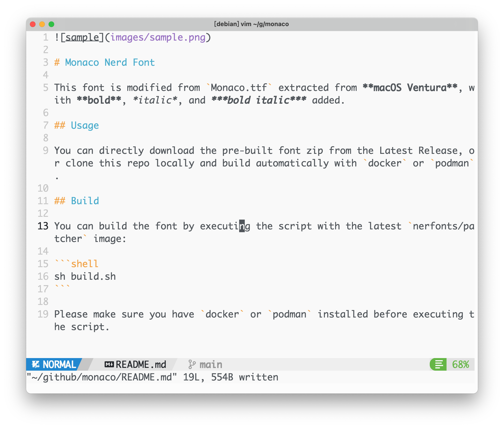

# Monaco Nerd Font

This font is modified from `Monaco.ttf` extracted from **macOS Ventura**, with **bold**, *italic*, and ***bold italic*** added.

## Usage

You can directly download the pre-built font zip from the Latest Release, or clone this repo locally and build automatically with `docker` or `podman`.

## Build

You can build the font by executing the script with the latest `nerfonts/patcher` image:

```shell
sh build.sh
```

Please make sure you have `docker` or `podman` installed before executing the script.

## Screenshots

neovim:


