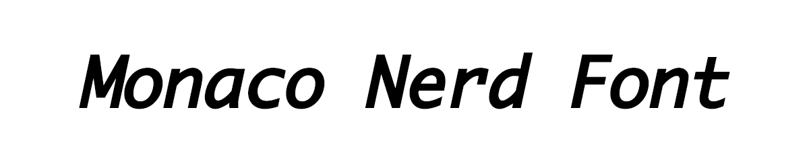
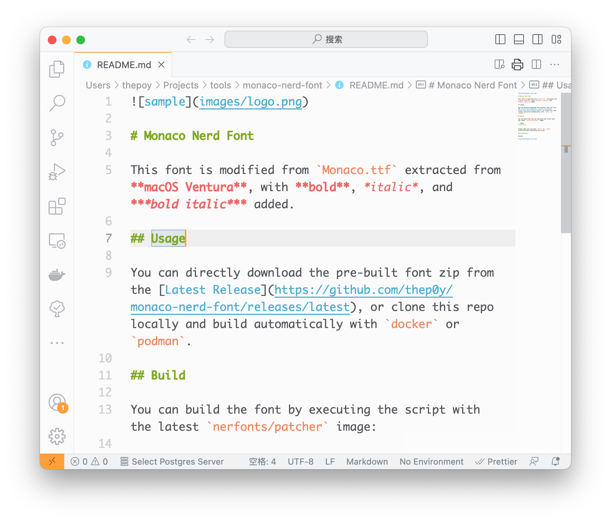
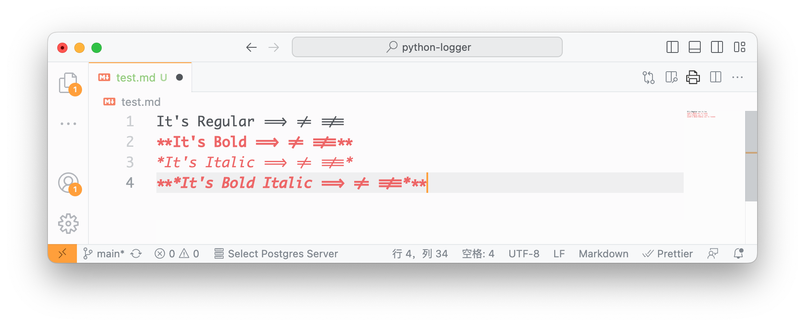

# Monaco Nerd Font

This font is modified from `Monaco.ttf` extracted from **macOS Ventura**, with **bold**, _italic_, and **_bold italic_** added.

## Usage

You can directly download the pre-built font zip from the [Latest Release](https://github.com/thep0y/monaco-nerd-font/releases/latest), or clone this repo locally and build automatically with `docker` or `podman`.

## Build

You can build the font by executing the script with the latest `nerfonts/patcher` image:

```shell
sh build.sh
```

Please make sure you have `docker` or `podman` installed before executing the script.

> Some terminals may not support ligatures, ligature fonts are not recommended for vim/nvim users.

## Screenshots

neovim:


vscode:



ligatures:



## Related Projects

- [nerd-fonts](https://github.com/ryanoasis/nerd-fonts)

- [Ligaturizer](https://github.com/ToxicFrog/Ligaturizer)
